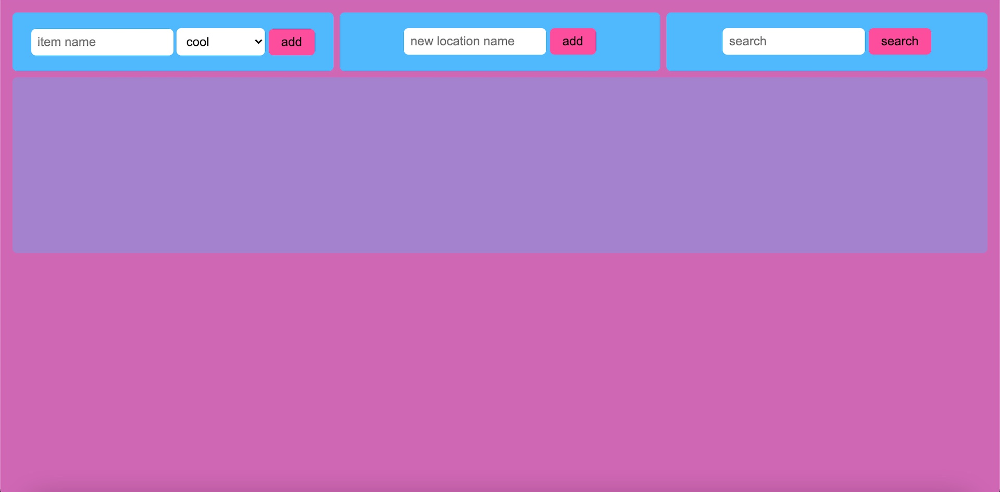

# Where's my stuff

A program to keep track of your stuff!

## Possible use cases:

Perfect to run on a home network, maybe you got a raspberry pi lying around or just some old computer.

## OBS!!!

If you are planning to run this "public", you really shouldn't. There is nothing that protects anything
from anything, there also is nothing stopping whomever to remove something. But if you fix that then
no problem, perhaps making so that if the request comes from your home local ip it allows, and if not it
doesn't allow?

You don't want to do anything yourself?
well, we'll see in the future what happens. Don't hold your breath though...

# Installation

1. Go to the projects root directory.
2. Run the command './setup.sh'
3. after setup is done, and you chose to not run but changed your mind, run './start.sh'
4. open browser of choice and type in the url.
5. enjoy!

# How to use

* Add Location by typing in the name and clicking add.
* When a location exists, you can add items to that location by choosing it in the dropdown and then typing in the item name.
* To show where items are, simply click the search button with no input to list them all.
* When you have found your item and its location you can click on the see more button.
* Now you should've got a bit more info about the item, and buttons to update the amount or delete the item from the location.

# Code Review

Code review written by [Emma Hansson](https://github.com/h-emma).

1. `example.js:10-15` - Remember to think about X and this could be refactored using the amazing Y function.
2. `example.js:10-15` - Remember to think about X and this could be refactored using the amazing Y function.
3. `example.js:10-15` - Remember to think about X and this could be refactored using the amazing Y function.
4. `example.js:10-15` - Remember to think about X and this could be refactored using the amazing Y function.
5. `example.js:10-15` - Remember to think about X and this could be refactored using the amazing Y function.

# Testers

Tested by the following people:

1. Jane Doe
2. John Doe
